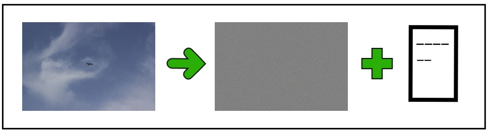
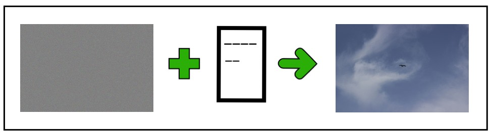

# unseen
---
unseen is a web application for encrypting/decrypting images. It uses a 256-bit key. The decryption process uses an additional _.dat file_ that contains metadata about the original state of the image. The _.dat file_ is relatively small. It stores at max 32 bits of data. The user's uploaded image is deleted from the server once the requirement is executed.

## The Tech Stack
1. C++ for the core algorithm.
2. Node.js and Express for backend server.
3. Vanilla JavaScript, CSS, HTML5 for the frontend.

## Build
1. clone this repository: `$ git clone https://github.com/viveknathani/unseen.git `
2. `$ cd unseen/build`
3. `python3 build.py`
4. `cd ..`
5. `node index.js`
6. `cd ../frontend`
7. open index.html in your favourite browser.

## Algorithm
We use the [**AES256**](https://en.wikipedia.org/wiki/Advanced_Encryption_Standard) algorithm in **CBC** mode.
## Example

    

    
    
